# Hi, I'm Seven 👋

### 🤖 AI Undergraduate · Full Stack Builder · Open Source Enthusiast

> *试逐鸿志，遇挫笃行，终成其事。*

---

## 🧠 About Me

- 🎓 人工智能在读本科生
- 💻 兴趣方向：**AI 应用落地**、**竞赛**、**全栈开发**
- ✍️ 技术博客：[Seven's Blog](https://seven-blog.pages.dev)
- 🔬 深度关注 **AI Agent 架构**、**LLM 成本优化**、**开源 AI 生态**
- 🌱 在学中建，在写中长

---

## 🛠️ Tech Stack

**Languages**

**Frontend**

**Backend & Database**

**AI / ML**

**Tools & Platform**

---

## 📊 GitHub Stats

---

## 🌱 Beyond Code

- 📺 **国漫** — 重度修仙党，《凡人修仙传》《仙逆》《剑来》
- 🎵 **音乐** — 听歌写代码两不误，华语 / 英文 / 轻音乐 / 纯音乐
- 📷 **摄影** — 扫街拍光影，主力手机党
- 🌍 **看世界** — 国际新闻、时政科技、多元视角
- 🔧 **硬件入门** — 单片机、嵌入式、电子 DIY，浅尝摸索中

> *生活和代码一样，需要保持好奇心和一点点折腾的兴致。*

---

### 📫 Let's Connect

